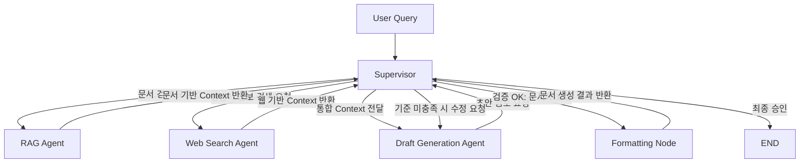

# Subject
AI Service Mini Project: Semiconductor R&D Strategy Report Generation with Multi-Agent Workflow

공개 PDF 문서와 웹 검색 결과를 결합해 HBM4, PIM, CXL 기술 및 Samsung, Micron의 경쟁 동향을 분석하고, SK hynix 관점의 기술 전략 보고서를 자동 생성하는 LangGraph 기반 멀티 에이전트 프로젝트입니다.

## Overview
- Objective : HBM4, PIM, CXL 관련 최신 공개 신호를 수집하고 경쟁사 기술 성숙도와 위협 수준을 분석해 R&D 의사결정에 바로 활용 가능한 보고서를 생성합니다.
- Method : Supervisor가 RAG, Web Search, Draft, Policy Check, Formatter를 순차 제어하며, PDF 기반 기술 근거와 웹 기반 경쟁사 신호를 결합해 보고서를 작성합니다.
- Tools : OpenAI API, Tavily Search, FAISS, Playwright

## Features
- PDF 자료 기반 정보 추출 : 반도체 기술 문서(PDF)에서 HBM, PIM, CXL 관련 핵심 근거를 추출합니다.
- 웹 기사 및 공개 신호 수집 : Samsung, Micron 관련 최신 로드맵, 샘플, 양산, 특허, 채용, 리스크 신호를 검색합니다.
- 하이브리드 검색 : Dense retrieval과 BM25를 결합해 문서 검색 품질을 높입니다.
- 주제별 컨텍스트 구성 : HBM, PIM, CXL 별로 RAG와 Web evidence를 분리 정리해 초안 품질을 높입니다.
- 보고서 자동 생성 : 정해진 템플릿에 맞춰 Markdown, HTML, PDF 보고서를 생성합니다.
- 정책 검증 : 구조 누락, TRL 표 품질, 경쟁사 범위, 근거 부족, 내부 모순 등을 점검합니다.
- 확증 편향 방지 전략 : 긍정/부정/간접 지표를 나눈 다중 웹 검색 쿼리와 편향 보완 재검색 루프를 통해 한쪽 관점으로 치우치는 문제를 줄입니다.

## Tech Stack

| Category   | Details                                |
|------------|----------------------------------------|
| Framework  | LangGraph, LangChain, Python           |
| LLM        | GPT-4o-mini via OpenAI API             |
| Retrieval  | FAISS + BM25 Hybrid Retrieval          |
| Embedding  | intfloat/multilingual-e5-large         |
| Search     | Tavily Search API                      |
| Output     | Markdown, HTML, PDF via Playwright     |

## Agents

- Supervisor Agent: 전체 워크플로우를 제어하고 RAG, Web Search, Draft, Policy Check, Formatter의 실행 순서를 결정합니다.
- RAG Agent: PDF 문서에서 기술 배경과 구조적 근거를 추출합니다.
- Web Search Agent: 경쟁사 및 시장 신호를 수집하고 TRL 관련 공개 정황을 정리합니다.
- Draft Agent: 수집된 근거를 바탕으로 전략 보고서 초안을 작성합니다.
- Policy Checker: 템플릿 준수, TRL 표 품질, 내부 모순, 근거 부족 여부를 검토합니다.
- Formatter: 최종 초안을 Markdown, HTML, PDF 형식으로 저장합니다.

## Architecture


```
## Retrieval 
=== Retrieval Evaluation Summary ===
Report: /Users/skax/skala/aiservice-mini/mini-project/outputs/reports/technology_strategy_report_20260410_164615.pdf
Retriever mode: hybrid
PDF references: ['2012.03112v5.pdf', 'Comparative Study of Thermal Dissipation in Increa.pdf', 'hbm.pdf']
Evaluated queries: 5
Hit Rate@1: 0.8000
Hit Rate@3: 1.0000
Hit Rate@5: 1.0000
MRR: 0.9000
```
## Directory Structure

```text
mini-project/
├── app/
│   ├── agents/            # Supervisor, RAG, Web Search, Draft, Policy Checker, Formatter
│   ├── graph/             # LangGraph workflow 및 routing/state
│   ├── prompts/           # 보고서 및 정책 검사용 프롬프트 템플릿
│   ├── retrieval/         # PDF 로더, 임베딩, 벡터스토어, hybrid retriever
│   ├── schemas/           # evidence schema
│   ├── utils/             # Tavily, TRL, state helper 등 유틸
│   └── main.py            # 실행 스크립트
├── data/
│   ├── raw_docs/          # PDF 문서
│   └── vectorstore/       # FAISS 인덱스 저장
├── outputs/
│   ├── before/            # 이전 결과 보관
│   ├── logs/              # 로그 파일
│   └── reports/           # 최종 보고서 저장
├── requirements.txt
└── README.md
```

## Contributors
- 배수정 : Prompt Engineering, Agent Design, PDF Parsing, Retrieval Agent
- 안가은 : Prompt Engineering, Agent Design, PDF Parsing, Retrieval Agent
